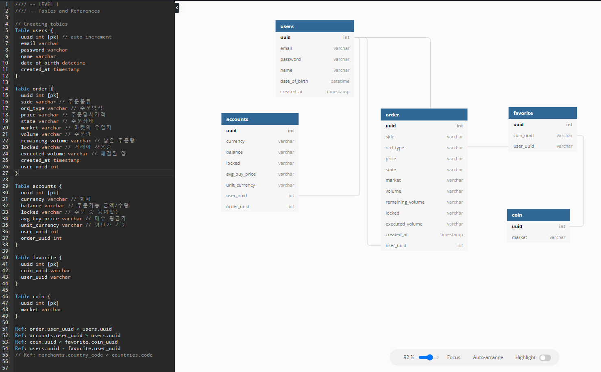

# 2020 02 20 시퀄라이즈에 대해 공부해보자

### codestates에서 과제로 살짝 본 것으로는 부족하다고 느꼈다.
### 자세히 알아보려고 작성한다.


## 먼저 작성한 db 구조이다.


# 1. schema 구조대로 시퀄라이즈에서의 models 구현
- [models 구성 방법](https://sequelize.org/v7/manual/model-basics.html)
  - [model 확장 래핑해서 써보기](https://jeonghwan-kim.github.io/dev/2020/07/06/sequelize-model.html)
- [데이터 타입](https://sequelize.org/v7/manual/model-basics.html#data-types)
- [일반 쿼리 사용법](https://sequelize.org/v7/manual/model-querying-basics.html)
- [row 쿼리 사용법](https://sequelize.org/v7/manual/raw-queries.html)
- [model 끼리의 관계 작성](https://sequelize.org/v7/manual/assocs.html)
- [컬럼 삭제 시간 이란](https://sequelize.org/v7/manual/paranoid.html)
- [validation 작성법](https://sequelize.org/v7/manual/validations-and-constraints.html)

일단 기본적으로 필요하다고 생각되는 페이지이다.

models 구성 먼저 보겠다.
sequelize 에서의 model은 db의 스케마 구조에 해당한다.
model 정의 부분은 일반형과 확장형 두 종류로 나누어져있다.

```javascript
const { Sequelize, DataTypes } = require('sequelize');
const sequelize = new Sequelize('sqlite::memory:');

const User = sequelize.define('User', {
  // Model attributes are defined here
  firstName: {
    type: DataTypes.STRING,
    allowNull: false
  },
  lastName: {
    type: DataTypes.STRING
    // allowNull defaults to true
  }
}, {
  // Other model options go here
});

// `sequelize.define` also returns the model
console.log(User === sequelize.models.User); // true
```

```javascript
const { Sequelize, DataTypes, Model } = require('sequelize');
const sequelize = new Sequelize('sqlite::memory:');

class User extends Model {
    otherPublicField;
}

User.init({
  // Model attributes are defined here
  firstName: {
    type: DataTypes.STRING,
    allowNull: false
  },
  lastName: {
    type: DataTypes.STRING
    // allowNull defaults to true
  }
}, {
  // Other model options go here
  sequelize, // We need to pass the connection instance
  modelName: 'User' // We need to choose the model name
});

// the defined model is the class itself
console.log(User === sequelize.models.User); // true
```

코드를 보면 sequelize 메소드를 통해 바로 정의하는법이 있고, User라는 model을 만들어 sequelize에 연결하는 방법으로 나누어져 있다.

두번째 방법을 확장형으로 소개한 이유는 `otherPublicField`가 써진 부분에 다른 필드를 추가할 수 있다.

클래스로 정의한 뒤 클래스 외부에서 스키마를 사용하는데 이 부분을 다르게 랩핑하여 사용한 자료가 있었다.

```javascript
const { Sequelize, DataTypes, Model } = require('sequelize');
const sequelize = new Sequelize('sqlite::memory:');
class User extends Model {
  // 초기화하는 정적 메소드
  static initialize(sequelize, DataTypes) {
    // 클래스 외부에서 호출했던 init() 메소드를 클래스 안으로 옮겼다
    super.init(
      {
        firstName: {
          DataTypes.STRING,
          allowNull: false
        },
        lastName: {
          DataTypes.STRING
      },
      },
      { sequelize, modelName: 'User'}
    )
  }
}
```


https://velog.io/@sunhwa508/sequelize-%EC%8B%9C%ED%80%84%EB%9D%BC%EC%9D%B4%EC%A6%88-%EB%AA%A8%EB%8D%B8-%EB%A7%8C%EB%93%A4%EA%B8%B0


https://sequelize.org/master/manual/migrations.html


https://sequelize.org/v7/manual/dialect-specific-things.html

https://sequelize.org/v6/manual/assocs.html
